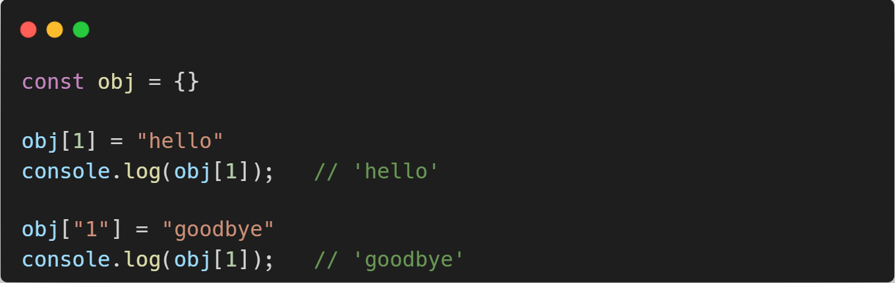
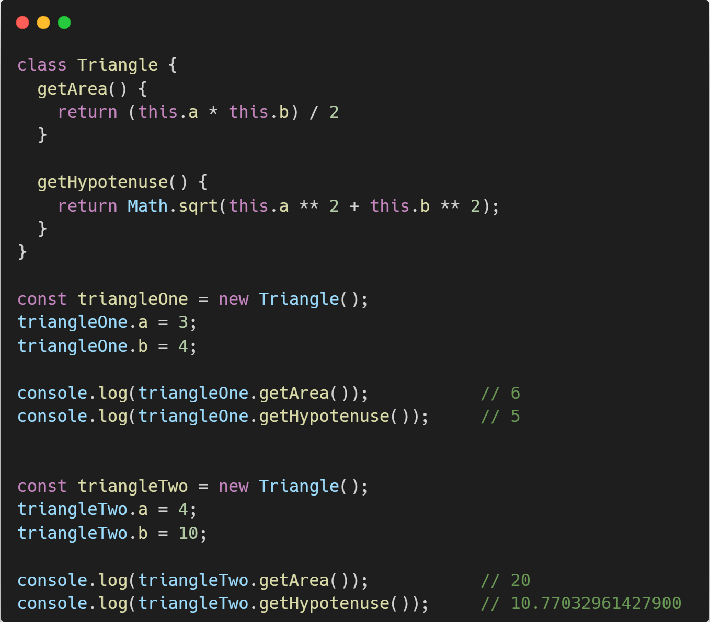
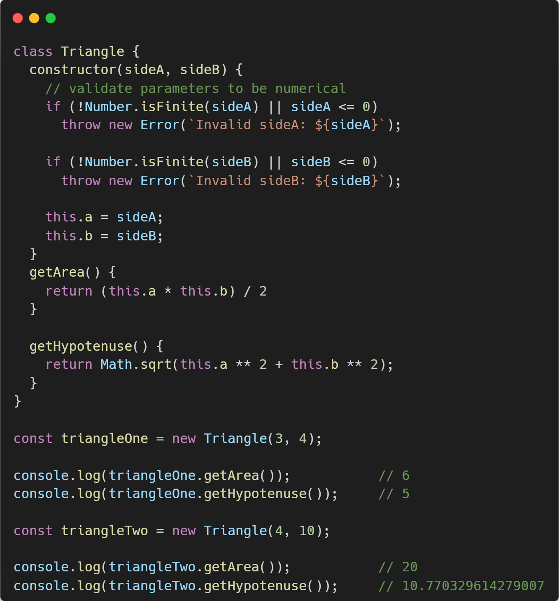
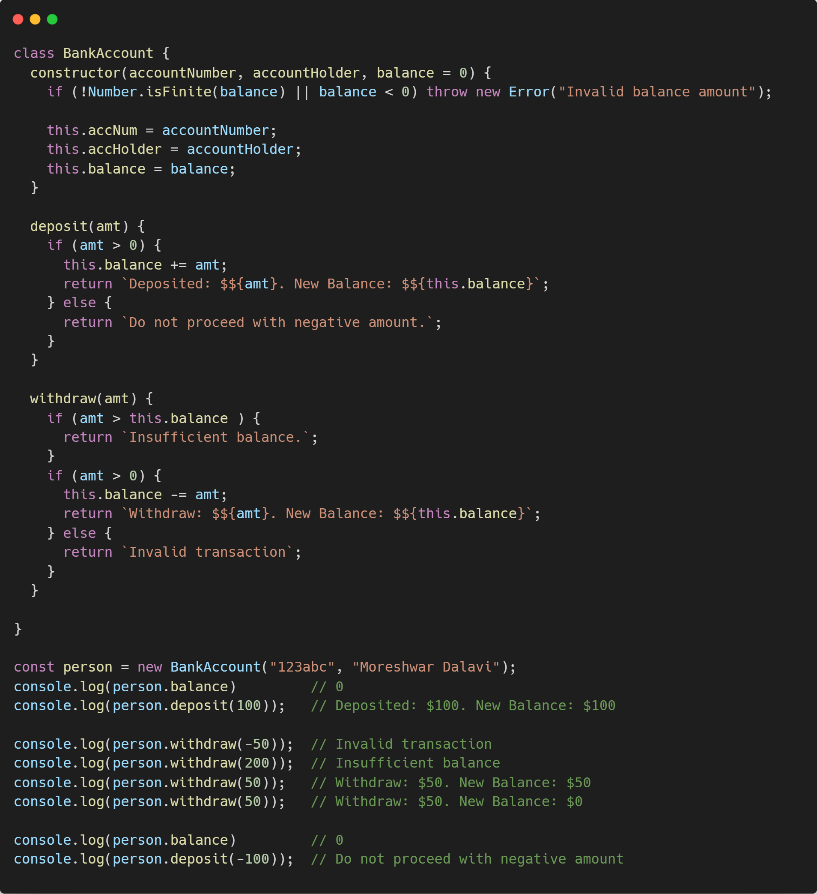
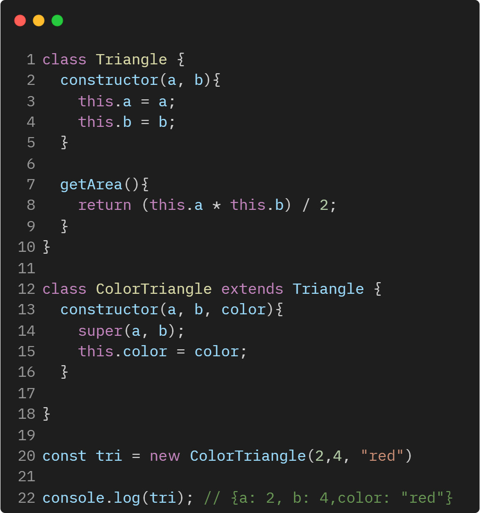
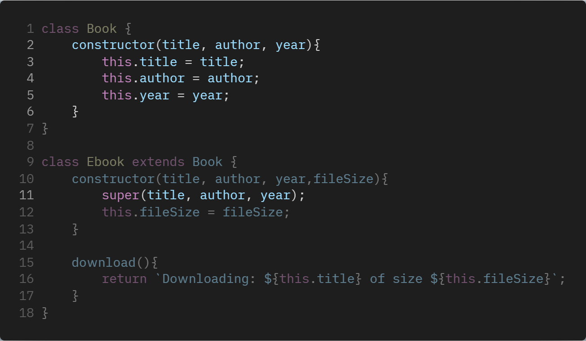
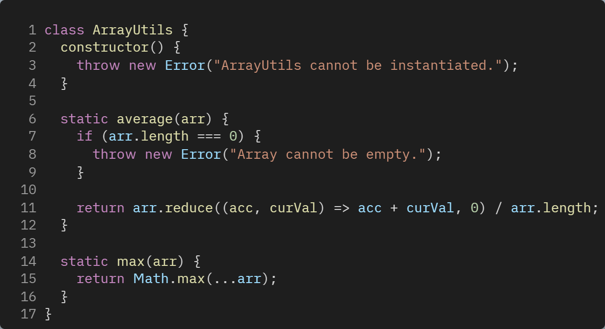
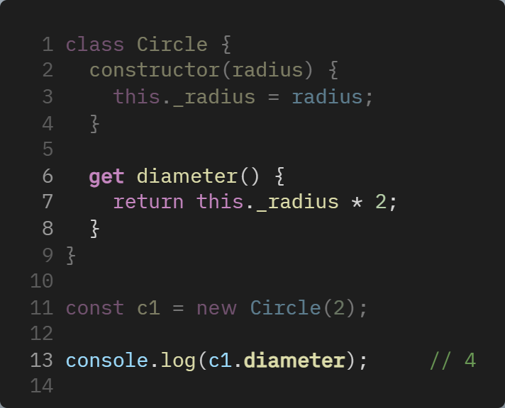
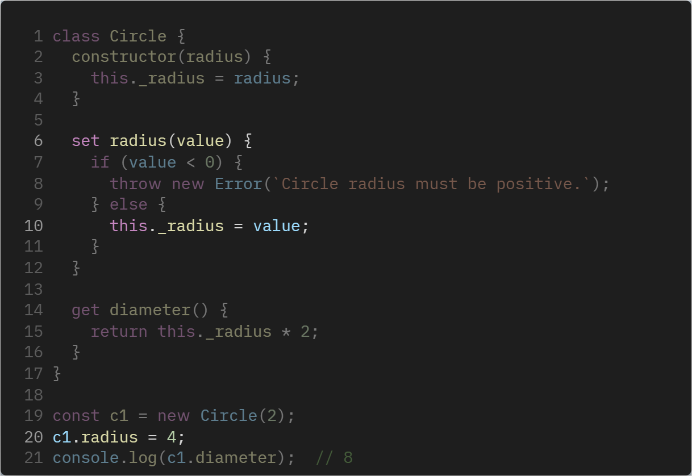

# 🐘 Advanced JavaScript

## **{ }** Objects

An object is a collection of properties and a property is an association between a `name (or key)` and a `value`. A property's value can be a function, in which case the property is known as `method`.

### Details should know

- Properties that don't exist evaluate to **`undefined`**
- All keys get **"stringifiled"**

<p align="center">
  
</p>

<details>
<summary><b>Multiple ways to define an object</b></summary>
<table>
  <tr>
    <th align="left">01 - With object literals</th>
  </tr>
  <tr>
    <td>
      <pre lang="js">
        const user = {
          name: "John",
          age: 30,
        };
      </pre>
    </td>
  </tr>
  <tr>
    <th align="left">02 - Object constructor without <code>this</code> keyword</th>
  </tr>
  <tr>
    <td>
      <pre lang="js">
        const user = Object({
          name: "John",
          age: 30,
        });
      </pre>
    </td>
  </tr>
  <tr>
    <th align="left">03 - Object constructor with <code>new</code> keyword</th>
  </tr>
  <tr>
    <td>
      <pre lang="js">
        const user = new Object({
          name: "John",
          age: 30,
        });
      </pre>
    </td>
  </tr> 
  <tr>
    <th align="left">04 - Using object <code>create()</code> method</th>
  </tr>
  <tr>
    <td>
      <pre lang="js">
        const human = {
          species: "human",
          isAlive: true,
        };
        const person = Object.create(human, {
          gender: {
            value: "Female",
            writable: true,
            enumerable: true,
            configurable: true,
          },
        });
        console.log(person);          // { gender: 'Female' }
        console.log(person.gender);   // Female
        console.log(person.species);  // human
        console.log(person.isAlive);  // true
      </pre>
    </td>
  </tr>
  <tr>
    <th align="left">05 - Using object <code>assign()</code> menthod</th>
  </tr>
  <tr>
    <td>
      <pre lang="js">
        const developer = Object.assign({}, {
          experienceLevel: "Senior",
          jobTitle: "Software Engineer",
        });
        console.log(developer);       // { experienceLevel: 'Senior', jobTitle: 'Software Engineer' }
      </pre>
    </td>
  </tr>
  <tr>
    <th align="left">06 - Using <code>constructor</code> function</th>
  </tr>
  <tr>
    <td>
      <pre lang="js">
        function Data(id, name, email) {
          this.id = id;
          this.name = name;
          this.email = email;
        }
        const userJosh = new Data(1, "Josh", "josh@gmail.com");
        console.log(userJosh);        // Data {id: 1, name: 'Josh', email: 'josh@gmail.com'}
      </pre>
    </td>
  </tr>
  <tr>
    <th align="left">07 - Using ES6 <code>class</code></th>
  </tr>
  <tr>
    <td>
      <pre lang="js">
        class Employee {
          constructor() {
            this.empId = 1;
            this.empName = "Mathew";
          }
        }           
        const emp = new Employee();         
        console.log(emp);              // Employee { empId: 1, empName: 'Mathew' }
      </pre>
    </td>
  </tr>
</table>
</details>

---

## Class

Classes is a blueprint of functionality to avoid code duplication.

Classes are a template for creating objects. They encapsulate data with code to work on that data. Classes in JS are built on [prototypes](#prototypes) but also have some syntax and semantics that are unique to classes.

Classes are in fact **Special functions**. Class can be defined as _class expression_ & _class decleration_

<p align="center">
  
</p>

### Constructor

The constructor method is a special method of the [Class](#Class) for creating & initializing an object instance of that class.

**What to do with the constructor?**

- Whatever you want.
- Common things
  - Validate data
  - assign properties

<p align="center">
  
</p>

> [!TIP]
>
> - Constructor calls automatically.
>
> - `this` refers to the instance of the class, not the class itself.

> [!NOTE]
>
> - The constructor function always returns `undefined`
>
> - It's bad practice to to call constructor functions explicitly.

#### 📖 Exersise

BankAccount class

- Properties
  - `balance` (defaults to 0 if not provided)
  - `accountHolder`
  - `accountNumber`
- Methods
  - `deposit(amt)` - increases balance by `amt`
  - `withdraw(amt)` - decreses credit by `amt`

<p align="center">
  
</p>

### Instance Methods

- Functions are placed in a class are _`methods`_ (instance methods)
- They have access to properties of the object with _`this`_
- They take arguments/returns data like any other function.

### Inheritance

- `Inheritance` means passing down characteristics from a parent to a child, so that new piece of code can reuse and build upon the features of exsiting one.
- `extends` keyword is use to make inheritance.

### _`super`_ keyword

- The `super` keyword is used to access properties of an object literal or calss's `[[prototype]]`, or invoke a superclass's constructor.

<p align="center">
  
</p>

<p align="center">
  
</p>

> [!TIP]
>
> We have to call `super` when we add own properties of the child class.

---

### _`static`_ Properties & Methods

- `static` methods and properties cannot directly accessed on instance of the class. Instead they're accessed by the `class` itself.

- Real life examples:
  - `Math()` function
    - `Math.random()`

#### **Exercises**

> **ArrayUtils exercise**
>
> Implement a class named ArrayUtils that cannot be instantiated and contains static methods average and max. If the class is instantiated throw an error with the message 'ArrayUtils cannot be instantiated.'
>
> The average method should return the average of an array of numbers. If the array is empty, throw an error with the message 'Array cannot be empty.'
> The max method should return the largest number from an array of numbers. You can assume you will always get passed an arrray of numbers
>
> <p align="center">
>   

</p>

> [!IMPORTANT]
>
> [Connect Four OO Exercise](https://rithm-students-assets.s3.us-west-1.amazonaws.com/udemy/exercises/connect-four-oo/handout/index.html)

---

## 🌱 Newer Object Oriented Features

### Getters & Setters

Allows to define the ways to retrive or change the values of an object properties respectively.

#### Getters

- Starts with `get` keyword
- Using `set` keyword prefix, helps to define somthing like that looks and feels like a property, but it is actually a method behind the scean.
- Example

<p align="center">
 
</p>

#### Setters

- Allows a mechanism to set the value of an object property.
- Example

<p align="center">
   
</p>

- In the above example, it seems to be we are trying to change the property of the instance, but its function behind the scenes.
-

- ##### Example

```javascript
class Circle {
  static allowedColors = new Set(["red", "green", "blue"]);

  constructor(radius, color) {
    this._radius = radius;
    this.validateColor(color);
  }

  validateColor(newColor) {
    if (Circle.allowedColors.has(newColor)) {
      this._color = newColor;
    } else {
      throw new Error("Invalid color");
    }
  }

  set radius(value) {
    if (value < 0) {
      throw new Error(`Circle radius must be positive.`);
    } else {
      this._radius = value;
    }
  }

  set color(value) {
    this.validateColor(value);
  }

  get diameter() {
    return this._radius * 2;
  }

  get color() {
    return this._color;
  }
}

const c1 = new Circle(2, "red");
c1.radius = 4;
console.log(c1.diameter, c1.color); // 8 'red'
```

Another example

```javascript
class User {
  constructor(firstName, lastName) {
    this.firstName = firstName;
    this.lastName = lastName;
  }

  get username() {
    return `${this.firstName} ${this.lastName}`;
  }

  set name(name) {
    const [firstName, lastName] = name.split(" ");
    this.firstName = firstName;
    this.lastName = lastName;
  }
}

const U1 = new User("Brandon", "Joe");
U1.name = "Jessica Mark";
console.log(U1.username); /// Jessica Mark
```

> [!TIP]
>
> In the above example of `getter` and `setter` we have used **\_** (underscore) as a styling convention to indicate that the property is private.

---

### Class Fields (Public & Private)
