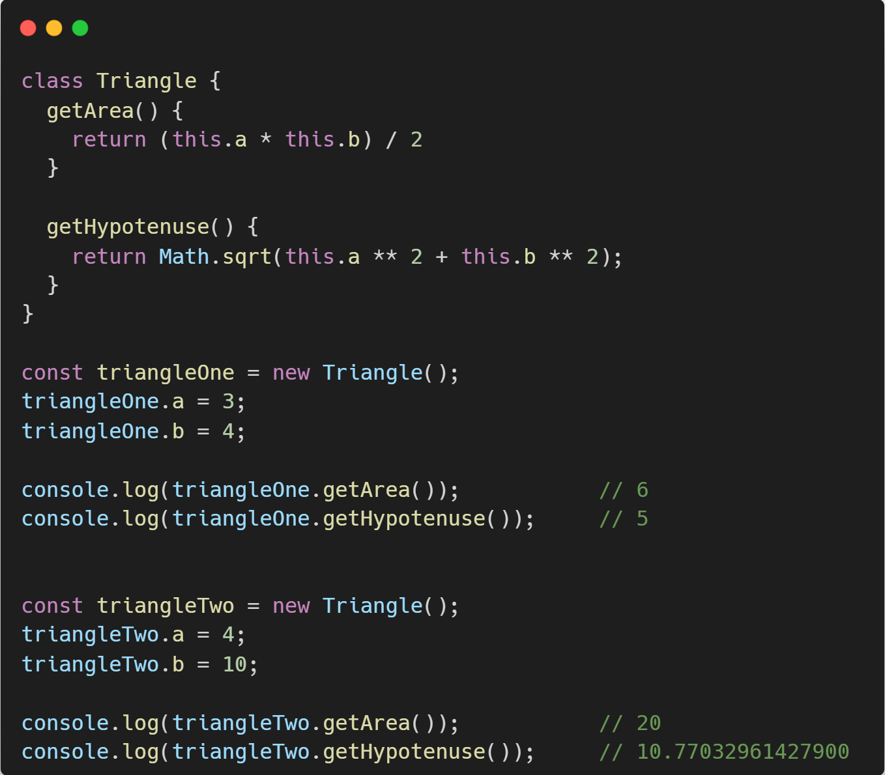

# 🐘 Advanced JavaScript

## **{ }** Objects

An object is a collection of properties and a property is an association between a `name (or key)` and a `value`. A property's value can be a function, in which case the property is known as `method`.

### Details should know

- Properties that don't exist evaluate to **`undefined`**
- All keys get **"stringifiled"**

<p align="center">
  
</p>

<details>
<summary><b>Multiple ways to define an object</b></summary>
<table>
  <tr>
    <th align="left">01 - With object literals</th>
  </tr>
  <tr>
    <td>
      <pre lang="js">
        const user = {
          name: "John",
          age: 30,
        };
      </pre>
    </td>
  </tr>
  <tr>
    <th align="left">02 - Object constructor without <code>this</code> keyword</th>
  </tr>
  <tr>
    <td>
      <pre lang="js">
        const user = Object({
          name: "John",
          age: 30,
        });
      </pre>
    </td>
  </tr>
  <tr>
    <th align="left">03 - Object constructor with <code>new</code> keyword</th>
  </tr>
  <tr>
    <td>
      <pre lang="js">
        const user = new Object({
          name: "John",
          age: 30,
        });
      </pre>
    </td>
  </tr> 
  <tr>
    <th align="left">04 - Using object <code>create()</code> method</th>
  </tr>
  <tr>
    <td>
      <pre lang="js">
        const human = {
          species: "human",
          isAlive: true,
        };
        const person = Object.create(human, {
          gender: {
            value: "Female",
            writable: true,
            enumerable: true,
            configurable: true,
          },
        });
        console.log(person);          // { gender: 'Female' }
        console.log(person.gender);   // Female
        console.log(person.species);  // human
        console.log(person.isAlive);  // true
      </pre>
    </td>
  </tr>
  <tr>
    <th align="left">05 - Using object <code>assign()</code> menthod</th>
  </tr>
  <tr>
    <td>
      <pre lang="js">
        const developer = Object.assign({}, {
          experienceLevel: "Senior",
          jobTitle: "Software Engineer",
        });
        console.log(developer);       // { experienceLevel: 'Senior', jobTitle: 'Software Engineer' }
      </pre>
    </td>
  </tr>
  <tr>
    <th align="left">06 - Using <code>constructor</code> function</th>
  </tr>
  <tr>
    <td>
      <pre lang="js">
        function Data(id, name, email) {
          this.id = id;
          this.name = name;
          this.email = email;
        }
        const userJosh = new Data(1, "Josh", "josh@gmail.com");
        console.log(userJosh);        // Data {id: 1, name: 'Josh', email: 'josh@gmail.com'}
      </pre>
    </td>
  </tr>
  <tr>
    <th align="left">07 - Using ES6 <code>class</code></th>
  </tr>
  <tr>
    <td>
      <pre lang="js">
        class Employee {
          constructor() {
            this.empId = 1;
            this.empName = "Mathew";
          }
        }           
        const emp = new Employee();         
        console.log(emp);              // Employee { empId: 1, empName: 'Mathew' }
      </pre>
    </td>
  </tr>
</table>
</details>

---

### Class

Classes is a blueprint of functionality to avoid code duplication.

Classes are a template for creating objects. They encapsulate data with code to work on that data. Classes in JS are built on [prototypes](#prototypes) but also have some syntax and semantics that are unique to classes.

Classes are in fact **Special functions**. Class can be defined as _class expression_ & _class decleration_

<p align="center">
  
</p>

### Constructor

The constructor method is a special method of the [Class](#Class) for creating & initializing an object instance of that class.

**What to do with the constructor?**

- Whatever you want.
- Common things
  - Validate data
  - assign properties

<p align="center">
  
</p>

> [!TIP]
>
> - Constructor calls automatically.
>
> - `this` refers to the instance of the class, not the class itself.

> [!NOTE]
>
> - The constructor function always returns `undefined`
>
> - It's bad practice to to call constructor functions explicitly.

#### 📖 Exersise

<!--
  BankAccount class
  - Properties
    - balance (defaults to 0 if not provided)
    - accountHolder
    - accountNumber
  - Methods
    - deposit(amt) - increases balance by amt
    - withdraw(amt) - decreses credit by amt
 -->

```javascript
class BankAccount {
  constructor(accountNumber, accountHolder, balance = 0) {
    if (!Number.isFinite(balance) || balance < 0)
      throw new Error("Invalid balance amount");

    this.accNum = accountNumber;
    this.accHolder = accountHolder;
    this.balance = balance;
  }

  deposit(amt) {
    if (amt > 0) {
      this.balance += amt;
      return `Deposited: $${amt}. New Balance: $${this.balance}`;
    } else {
      return `Do not proceed with negative amount.`;
    }
  }

  withdraw(amt) {
    if (amt > this.balance) {
      return `Insufficient balance.`;
    }
    if (amt > 0) {
      this.balance -= amt;
      return `Withdraw: $${amt}. New Balance: $${this.balance}`;
    } else {
      return `Invalid transaction`;
    }
  }
}

const person = new BankAccount("123abc", "Moreshwar Dalavi");
console.log(person.balance); // 0
console.log(person.deposit(100)); // Deposited: $100. New Balance: $100

console.log(person.withdraw(-50)); // Invalid transaction
console.log(person.withdraw(200)); // Insufficient balance
console.log(person.withdraw(50)); // Withdraw: $50. New Balance: $50
console.log(person.withdraw(50)); // Withdraw: $50. New Balance: $0

console.log(person.balance); // 0
console.log(person.deposit(-100)); // Do not proceed with negative amount.
```

---
